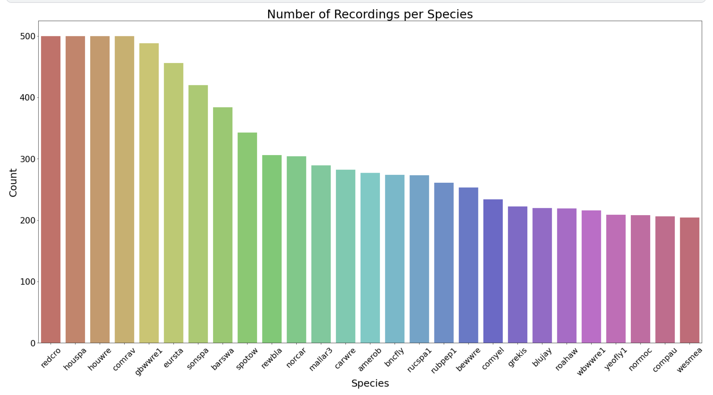
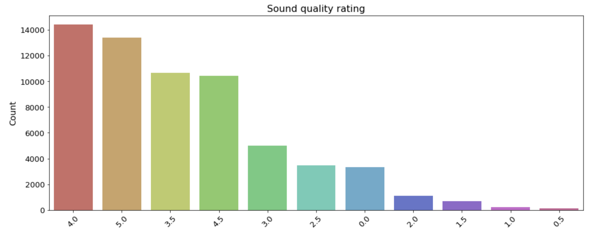
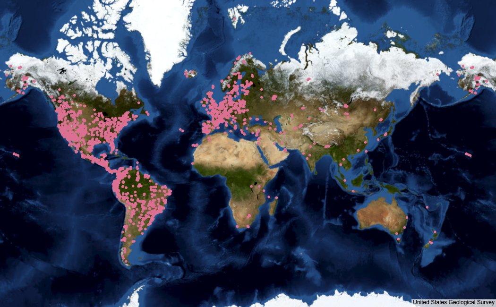
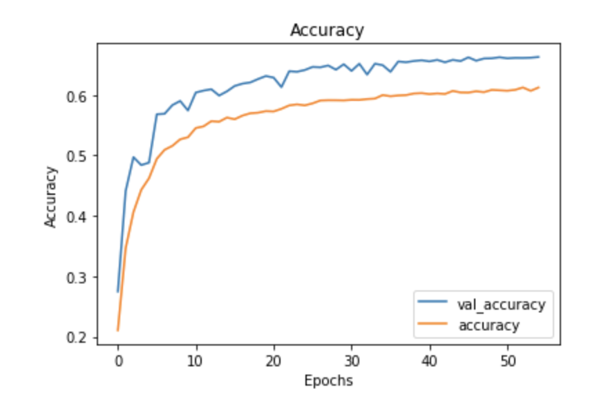

# BirdCLEF-2021 Birdcall Classification

## Background

The Cornell Lab of Ornithology estimates about 10,000 bird species throughout the world. In addition to their relatively high position in the food chain, this makes birds great informants of air quality and biodiversity in various ecosystems. The identification of birds in their habitats is especially helpful for researchers and ornithological experts to implement conservation efforts.

Machine learning, particularly deep learning, has been helpful in bolstering acoustic data collection. Models to date, however, have presented inconsistencies in precision and recall abilities.

Source: [BirdCLEF 2021 Kaggle Competition](https://www.kaggle.com/c/birdclef-2021)

## Objective

This project seeks to implement deep learning techniques to identify bird species captured in audio recordings. Multiple model architectures have been constructed and compared against each other for accuracy and loss (error) scores.

## Data

The data was obtained from the BirdCLEF 2021 Kaggle competition. The original dataset contains over 62,000 audio recordings. Around 8,500 of those recordings were used in the analysis.



Here are the counts of ratings for each recording.



Here are the geographical locations for each recording.



## Results

Various model architectures have been compared against each other in terms of accuracy and loss scores.

The baseline model was a CNN based on [Valerio Velardo's](https://github.com/musikalkemist/pytorchforaudio/blob/main/08%20Implementing%20a%20CNN%20network/cnn.py) baseline CNN in his YouTube series, [PyTorch for Audio](https://www.youtube.com/watch?v=gp2wZqDoJ1Y&list=PL-wATfeyAMNoirN4idjev6aRu8ISZYVWm&ab_channel=ValerioVelardo-TheSoundofAI). This model had a 76.49% training accuracy and a 52.56% testing accuracy.

Among the models examined was an adapted version of an LSTM constructed by [Seth Adams](https://github.com/seth814/Audio-Classification/blob/master/models.py). This returned a training accuracy of 68.90% and a testing accuracy of 43.05%.

The model selected for further optimization was a CNN architecture inspired by [Stefan Kahl](https://www.kaggle.com/stefankahl/birdclef2021-model-training). This initially returned a training accuracy of 86.81% and a testing accuracy of 68.65%.

This model's performance was more deeply examined when utilizing L1 (lasso) vs L2 (ridge) regularization, relocation of dropout layers, and trimming of trainable parameters in order to mitigate overfitting. The final prototype's performancers were 71.51% during training and 66.06% during testing.



## Future Work

The first iteration of this project sets the baseline for future work and improvements. More advanced steps in data pre-processing, especially with robust filtering methods, are warranted.

For BirdCLEF 2021, the main goal is to expand from the 27 species in this experiment to all species of birds in the dataset. This will incorporate more data for the models to train on and, hopefully, improve its performance.

Audio classification is highly generalizable to various domains. This task has been performed on [instrument classification](https://github.com/seth814/Audio-Classification). I hope to use this project as a springboard for music-related projects that need not relate to classification, such as sound synthesis and generation.

## For More Information

For any additional questions, please contact [Jeremy Pagirsky](mailto:jeremy.pagirsky@gmail.com).

## References

- [Stefan Kahl](https://www.kaggle.com/stefankahl/birdclef2021-model-training)
- [Ayush Thakur](https://www.kaggle.com/ayuraj/birdclef-quick-eda-with-w-b)
- [DrCapa](https://www.kaggle.com/drcapa/birdclef-2021-starter)
- [Andrey Shtrauss](https://www.kaggle.com/shtrausslearning/keras-inference-birdclef2021-starter)
- [Valerio Velardo](https://github.com/musikalkemist/pytorchforaudio/blob/main/08%20Implementing%20a%20CNN%20network/cnn.py)
- [Francois Lemarchand](https://www.kaggle.com/frlemarchand/bird-song-classification-using-an-efficientnet)
- [Seth Adams](https://github.com/seth814/Audio-Classification/blob/master/models.py)
- [Adam Sabra](https://github.com/theadamsabra/InstrumentClassifier)

## Repository Structure

```
├── images                                     <- Images of models' accuracy and loss scores during training
├── README.md                                  <- The README for reviewers of this project
├── birdclef-audio-classification.ipynb        <- Project code
├── presentation.pdf                           <- Non-technical presentation